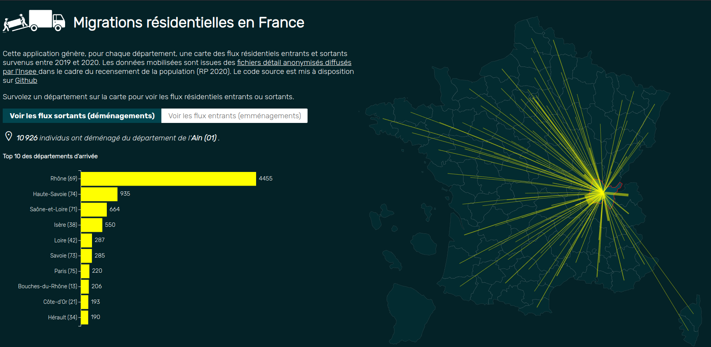

This is the source code of an interactive web-app that generates, for every department of France, a connection map of incoming and outgoing residential flows that happened between 2019 and 2020. 

Source data : Insee, anonymised detail files extracted from the population census of 2020 (RP 2020) : https://www.insee.fr/fr/statistiques/7637890

The data wrangling has been done with a python script (3.10) using the following libraries : Dask, Geopandas 

This app is realized with plain HTML/CSS/Javascript and D3.js (v7) : https://d3js.org
